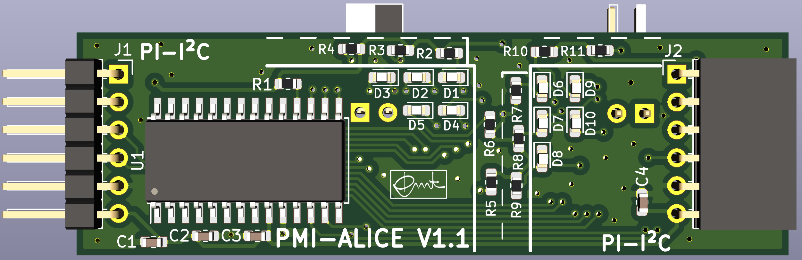

# PMI Advanced Lights I2C Extension (ALICE)

This pcb is designed for the course PMI (Practical course Microcontroller
and Interface electronics) to model crossroads with traffic lights. It uses
an I2C port expander to drive several leds.

Pin header and sockets are compatible with
[Digilents Pmod](https://digilent.com/reference/pmod/start) interface.

The board can be used with [PMI's BoB²](https://github.com/emtpb/pmi-hw-bob2)
pcb.

An interactive html BOM file with pcb layout and material placement can be
found [here](bom/ibom.html).

# Changelog

## V1.0
* First prototype.

## V1.1
* First release.

## V1.2
* Add reset bridge to be able to reset the ic at power up
